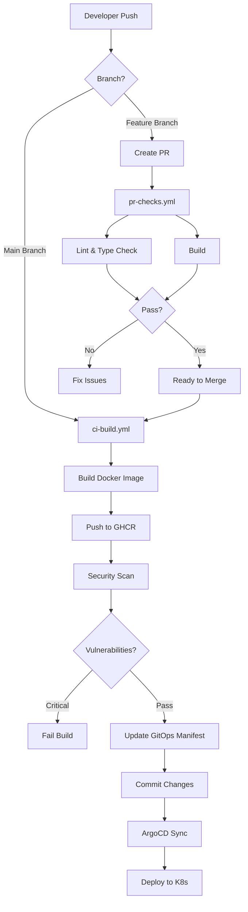

# GitHub Actions CI/CD Workflows

## Overview

This repository uses GitHub Actions for continuous integration and deployment with a GitOps approach.

## Workflows

### 1. PR Checks (`pr-checks.yml`)

**Trigger**: Pull requests to `main` or `develop`

**Purpose**: Validate code quality before merging

**Jobs**:
1. **Lint and Type Check**
   - Runs ESLint
   - Runs TypeScript type checking
   - Fails PR if errors found

2. **Build**
   - Compiles production build
   - Uploads build artifacts
   - Reports build size

**Status**: ✅ Active

### 2. CI Build & Deploy (`ci-build.yml`)

**Trigger**: Push to `main` branch

**Purpose**: Build Docker image and update GitOps manifests

**Jobs**:
1. **Build and Push**
   - Builds multi-platform Docker image
   - Pushes to GitHub Container Registry
   - Generates SBOM (Software Bill of Materials)
   - Caches layers for faster builds

2. **Security Scan**
   - Scans image with Trivy
   - Uploads results to GitHub Security
   - Fails on HIGH/CRITICAL vulnerabilities

3. **Update GitOps Manifest**
   - Updates Kubernetes deployment YAML
   - Commits new image tag to repository
   - Triggers ArgoCD sync

4. **Deployment Notification**
   - Creates deployment summary
   - Posts to GitHub summary page

**Status**: ✅ Active

## Workflow Diagram



## Setup Instructions

### Prerequisites

1. **GitHub Repository Secrets**
   ```
   GITHUB_TOKEN - Auto-provided by GitHub
   ```

2. **GitHub Container Registry**
   - Enabled by default for repositories
   - Images: `ghcr.io/USERNAME/REPO/reactapp`

3. **Repository Permissions**
   - Settings → Actions → General
   - Workflow permissions: Read and write permissions
   - Allow GitHub Actions to create pull requests: ✅

### Configuration Steps

#### 1. Update Workflow Files

**Replace placeholders:**

```yaml
# In ci-build.yml
env:
  REGISTRY: ghcr.io
  IMAGE_NAME: ${{ github.repository }}/reactapp  # Auto-uses your repo

# In update-gitops-manifest job
repository: ${{ github.repository }}  # Auto-uses your repo
```

#### 2. Update Kubernetes Manifests

```yaml
# In k8s/reactapp/deployment.yaml
image: ghcr.io/YOUR_USERNAME/YOUR_REPO/reactapp:latest

# In k8s/reactapp/kustomization.yaml
images:
  - name: ghcr.io/YOUR_USERNAME/YOUR_REPO/reactapp
    newTag: latest
```

#### 3. Configure Branch Protection

Settings → Branches → Add rule for `main`:

- ✅ Require a pull request before merging
- ✅ Require status checks to pass
  - `Lint and Type Check`
  - `Build Application`
- ✅ Require branches to be up to date
- ✅ Do not allow bypassing

## Running Workflows

### Automatic Triggers

**PR Checks**:
```bash
git checkout -b feature/my-feature
git add .
git commit -m "feat: add new feature"
git push origin feature/my-feature
# Create PR on GitHub → Workflow runs automatically
```

**CI Build**:
```bash
# After PR is merged to main
git checkout main
git pull origin main
# Workflow runs automatically
```

### Manual Triggers

```bash
# Using GitHub CLI
gh workflow run pr-checks.yml
gh workflow run ci-build.yml

# Or use GitHub UI
# Actions tab → Select workflow → Run workflow
```

## Monitoring Workflows

### View Workflow Runs

```bash
# List recent runs
gh run list

# View specific run
gh run view <run-id>

# Watch run in real-time
gh run watch <run-id>

# View logs
gh run view <run-id> --log
```

### Status Badges

Add to README.md:

```markdown


```

## Workflow Customization

### Adding Environment Variables

**In workflow file:**

```yaml
env:
  NODE_ENV: production
  API_URL: https://api.example.com

jobs:
  build:
    steps:
      - name: Build
        env:
          CUSTOM_VAR: value
        run: npm run build
```

### Adding Secrets

```bash
# Using GitHub CLI
gh secret set MY_SECRET

# Or via GitHub UI
Settings → Secrets and variables → Actions → New repository secret
```

**Use in workflow:**

```yaml
- name: Deploy
  env:
    SECRET_KEY: ${{ secrets.MY_SECRET }}
  run: ./deploy.sh
```

### Adding Matrix Builds

```yaml
strategy:
  matrix:
    node-version: [18, 20, 22]
    os: [ubuntu-latest, windows-latest, macos-latest]
steps:
  - uses: actions/setup-node@v4
    with:
      node-version: ${{ matrix.node-version }}
```

## Caching Strategies

### NPM Dependencies

```yaml
- uses: actions/setup-node@v4
  with:
    node-version: '20'
    cache: 'npm'
    cache-dependency-path: reactapp/package-lock.json
```

### Docker Layers

```yaml
- name: Build and push
  uses: docker/build-push-action@v5
  with:
    cache-from: type=gha
    cache-to: type=gha,mode=max
```

**Reduces build time by 50-70%**

## Security Best Practices

### 1. Least Privilege Permissions

```yaml
permissions:
  contents: read      # Read repository content
  packages: write     # Push to GHCR
  security-events: write  # Upload security scans
```

### 2. Pin Action Versions

```yaml
# ❌ Bad - uses latest (risky)
uses: actions/checkout@v4

# ✅ Good - pinned to commit SHA
uses: actions/checkout@b4ffde65f46336ab88eb53be808477a3936bae11  # v4.1.1
```

### 3. Scan Dependencies

```yaml
- name: Run Trivy vulnerability scanner
  uses: aquasecurity/trivy-action@master
  with:
    scan-type: 'fs'
    scan-ref: '.'
    format: 'sarif'
    output: 'trivy-results.sarif'
```

### 4. SBOM Generation

```yaml
- name: Generate SBOM
  uses: anchore/sbom-action@v0
  with:
    format: spdx-json
    output-file: sbom.spdx.json
```

## Troubleshooting

### Build Failures

**Check logs:**
```bash
gh run view --log
```

**Common issues:**
1. **Node version mismatch** - Update `node-version` in workflow
2. **Dependency conflicts** - Clear cache, update package-lock.json
3. **TypeScript errors** - Run `npm run lint` locally first
4. **Build timeout** - Increase timeout or optimize build

### Image Push Failures

**Check permissions:**
```bash
# Verify GHCR token
echo ${{ secrets.GITHUB_TOKEN }} | docker login ghcr.io -u ${{ github.actor }} --password-stdin
```

**Common issues:**
1. **Authentication failed** - Check repository permissions
2. **Image size too large** - Optimize Dockerfile
3. **Network timeout** - Retry or check network

### GitOps Update Failures

**Check manifest update:**
```bash
# View diff
git diff k8s/reactapp/deployment.yaml

# Check commit
git log --oneline -1
```

**Common issues:**
1. **Merge conflicts** - Resolve manually
2. **Invalid YAML** - Validate with `kubectl apply --dry-run`
3. **ArgoCD not syncing** - Check ArgoCD logs

## Performance Optimization

### Workflow Execution Time

**Current times:**
- PR Checks: ~3-5 minutes
- CI Build: ~5-8 minutes (with cache)

**Optimization tips:**
1. Enable caching (npm, Docker layers)
2. Run jobs in parallel where possible
3. Use `concurrency` to cancel outdated runs
4. Optimize Docker build context

### Cancel Redundant Runs

```yaml
concurrency:
  group: ${{ github.workflow }}-${{ github.ref }}
  cancel-in-progress: true
```

## Workflow Templates

### Adding New Workflow

Create `.github/workflows/my-workflow.yml`:

```yaml
name: My Workflow

on:
  push:
    branches: [main]

jobs:
  my-job:
    runs-on: ubuntu-latest
    steps:
      - uses: actions/checkout@v4
      - name: Run command
        run: echo "Hello World"
```

### Reusable Workflows

Create `.github/workflows/reusable-build.yml`:

```yaml
name: Reusable Build

on:
  workflow_call:
    inputs:
      node-version:
        required: true
        type: string

jobs:
  build:
    runs-on: ubuntu-latest
    steps:
      - uses: actions/setup-node@v4
        with:
          node-version: ${{ inputs.node-version }}
```

Use in other workflows:

```yaml
jobs:
  call-build:
    uses: ./.github/workflows/reusable-build.yml
    with:
      node-version: '20'
```

## Cost Optimization

### GitHub Actions Minutes

**Free tier:**
- Public repos: Unlimited
- Private repos: 2,000 minutes/month

**Optimization:**
- Use self-hosted runners for private repos
- Cache dependencies aggressively
- Use `if` conditions to skip unnecessary jobs
- Clean up old workflow runs

### Cleanup Script

```yaml
- name: Delete old workflow runs
  uses: Mattraks/delete-workflow-runs@v2
  with:
    retain_days: 30
    keep_minimum_runs: 10
```

## References

- [GitHub Actions Documentation](https://docs.github.com/en/actions)
- [Workflow Syntax](https://docs.github.com/en/actions/using-workflows/workflow-syntax-for-github-actions)
- [GitHub Container Registry](https://docs.github.com/en/packages/working-with-a-github-packages-registry/working-with-the-container-registry)
- [ArgoCD](https://argo-cd.readthedocs.io/)
