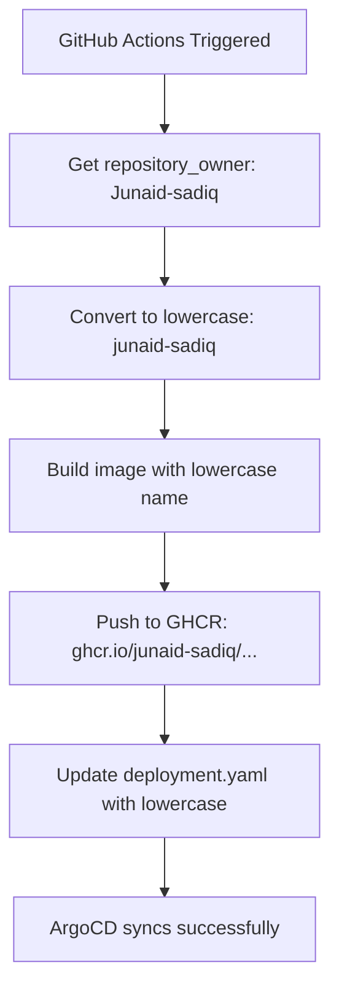

# Lowercase Image Name Fix ✅

## Issue: InvalidImageName in ArgoCD

### Problem
Your pods were failing with `InvalidImageName` error because the image URL contained uppercase characters:

```yaml
# ❌ INVALID (uppercase J)
image: ghcr.io/Junaid-sadiq/multinode-gitops-cluster/reactapp:...

# ✅ VALID (all lowercase)
image: ghcr.io/junaid-sadiq/multinode-gitops-cluster/reactapp:...
```

**Root Cause**: Docker and Kubernetes container registries (including GHCR) require **all lowercase** repository names and paths.

---

## What Was Fixed

### 1. ✅ Updated deployment.yaml
**File**: `k8s/reactapp/deployment.yaml`

**Before**:
```yaml
image: ghcr.io/Junaid-sadiq/multinode-gitops-cluster/reactapp:8065572e...
```

**After**:
```yaml
image: ghcr.io/junaid-sadiq/multinode-gitops-cluster/reactapp:sha-8065572e...
```

### 2. ✅ Fixed ci-build.yml Workflow
**File**: `.github/workflows/ci-build.yml`

**Changes**:
- Added step to convert `${{ github.repository_owner }}` to lowercase
- Updated all image references to use lowercase owner name
- Ensures future builds always use lowercase

**Key additions**:
```yaml
- name: Convert repository owner to lowercase
  id: repo
  run: |
    echo "owner_lc=${OWNER,,}" >> $GITHUB_OUTPUT
    echo "image_name=ghcr.io/${OWNER,,}/multinode-gitops-cluster/reactapp" >> $GITHUB_OUTPUT
  env:
    OWNER: ${{ github.repository_owner }}
```

### 3. ✅ Fixed ci-build-simple.yml Workflow
**File**: `.github/workflows/ci-build-simple.yml`

**Changes**:
- Same lowercase conversion logic
- All image references updated to use lowercase

---

## How Lowercase Conversion Works

### GitHub Actions Variables

**Problem**: GitHub provides these variables with original casing:
```yaml
${{ github.repository_owner }}  # Returns: "Junaid-sadiq"
${{ github.repository }}         # Returns: "Junaid-sadiq/multinode-gitops-cluster"
```

**Solution**: Bash parameter expansion to convert to lowercase:
```bash
OWNER_LC=${OWNER,,}  # Converts to: "junaid-sadiq"
```

Or using `tr` command:
```bash
OWNER_LC=$(echo "$OWNER" | tr '[:upper:]' '[:lower:]')
```

### Updated Workflow Logic



---

## Verification

### Check Deployment Manifest
```bash
cat k8s/reactapp/deployment.yaml | grep image:
```

**Expected output**:
```yaml
image: ghcr.io/junaid-sadiq/multinode-gitops-cluster/reactapp:sha-...
```

### Check GHCR Package
Your images will be at:
```
https://github.com/users/junaid-sadiq/packages/container/package/multinode-gitops-cluster%2Freactapp
```

Note: The package path in GHCR is **case-insensitive for viewing**, but the image pull URL **must be lowercase**.

---

## Why This Happens

### Docker/OCI Registry Specification
The [OCI Distribution Specification](https://github.com/opencontainers/distribution-spec) requires:
- Repository names must be **lowercase**
- Allowed characters: `a-z`, `0-9`, `-`, `_`, `.`, `/`
- No uppercase letters allowed

### GitHub Behavior
- **GitHub usernames**: Case-insensitive (`Junaid-sadiq` = `junaid-sadiq`)
- **GHCR image paths**: Case-sensitive, must be lowercase
- **GitHub Actions variables**: Preserve original casing

This mismatch causes the issue when using `${{ github.repository_owner }}` directly.

---

## Files Modified

| File | Change | Status |
|------|--------|--------|
| `k8s/reactapp/deployment.yaml` | Changed `Junaid-sadiq` → `junaid-sadiq` | ✅ Fixed |
| `.github/workflows/ci-build.yml` | Added lowercase conversion | ✅ Fixed |
| `.github/workflows/ci-build-simple.yml` | Added lowercase conversion | ✅ Fixed |

---

## Testing the Fix

### Step 1: Commit and Push
```bash
git add .
git commit -m "fix: convert image names to lowercase for GHCR compatibility"
git push origin main
```

### Step 2: Wait for GitHub Actions
Monitor at: `https://github.com/Junaid-sadiq/multinode-gitops-cluster/actions`

Expected:
- ✅ Build completes successfully
- ✅ Image pushed to GHCR with lowercase path
- ✅ deployment.yaml updated with lowercase image

### Step 3: Check ArgoCD
ArgoCD will detect the updated manifest and sync automatically.

**Expected status**:
- **Sync Status**: Synced ✅
- **Health Status**: Healthy ✅
- **Pods**: 3/3 Running ✅

### Step 4: Verify Pods
If you have kubectl access:
```bash
kubectl get pods -n reactapp
```

Expected output:
```
NAME                           READY   STATUS    RESTARTS   AGE
reactapp-ui-xxxxx-yyyyy        1/1     Running   0          2m
reactapp-ui-xxxxx-zzzzz        1/1     Running   0          2m
reactapp-ui-xxxxx-aaaaa        1/1     Running   0          2m
```

---

## ArgoCD Sync Behavior

### Before Fix
```
Sync Status: Synced ✅
Health Status: Degraded ❌
Pods: 0/3 InvalidImageName
```

**Error in pod events**:
```
Failed to pull image "ghcr.io/Junaid-sadiq/...": invalid reference format
```

### After Fix
```
Sync Status: Synced ✅
Health Status: Healthy ✅
Pods: 3/3 Running
```

**Successful pull**:
```
Successfully pulled image "ghcr.io/junaid-sadiq/..." in 15.2s
```

---

## Preventing This Issue

### Best Practices

1. **Always use lowercase in image references**
   ```yaml
   # Good
   image: ghcr.io/username/repo:tag
   
   # Bad
   image: ghcr.io/UserName/repo:tag
   ```

2. **Convert GitHub variables in workflows**
   ```yaml
   - name: Get lowercase owner
     run: echo "OWNER_LC=${GITHUB_REPOSITORY_OWNER,,}" >> $GITHUB_ENV
   ```

3. **Use explicit image names**
   ```yaml
   env:
     IMAGE_NAME: ghcr.io/junaid-sadiq/multinode-gitops-cluster/reactapp
   ```

4. **Validate image names in CI**
   ```bash
   # Add validation step
   if [[ "$IMAGE_NAME" =~ [A-Z] ]]; then
     echo "Error: Image name contains uppercase letters"
     exit 1
   fi
   ```

---

## Common Scenarios

### Scenario 1: Multiple Collaborators
If your repo has multiple owners with different casing:
```yaml
# Always convert to lowercase
OWNER_LC=$(echo "${{ github.actor }}" | tr '[:upper:]' '[:lower:]')
```

### Scenario 2: Forked Repositories
When forking, ensure workflows still use lowercase:
```yaml
# Works for any fork
IMAGE_NAME="ghcr.io/${GITHUB_REPOSITORY_OWNER,,}/${GITHUB_REPOSITORY##*/}"
```

### Scenario 3: Multiple Registries
If using multiple registries (DockerHub, GHCR, etc.):
```yaml
# All major registries require lowercase
DOCKERHUB_IMAGE: docker.io/junaid-sadiq/reactapp
GHCR_IMAGE: ghcr.io/junaid-sadiq/reactapp
QUAY_IMAGE: quay.io/junaid-sadiq/reactapp
```

---

## Troubleshooting

### Issue: Still seeing uppercase in logs
**Check**: Ensure you're looking at the **latest** workflow run, not an old one.

### Issue: Image not found in GHCR
**Solution**: 
1. Check package visibility (public vs private)
2. Verify image actually pushed: `docker pull ghcr.io/junaid-sadiq/...`
3. Check GHCR permissions in workflow

### Issue: ArgoCD not syncing
**Solution**:
1. Force refresh: Click "Refresh" in ArgoCD UI
2. Check sync status: Look for errors in ArgoCD app
3. Manually sync: Click "Sync" button

---

## Image Naming Rules

### Valid Image Names ✅
```
ghcr.io/junaid-sadiq/app:tag
ghcr.io/user/multi-word-repo/app:v1.0.0
ghcr.io/org/repo_name/app:sha-abc123
```

### Invalid Image Names ❌
```
ghcr.io/Junaid-Sadiq/app:tag         # Uppercase letters
ghcr.io/user/my repo/app:tag         # Spaces
ghcr.io/user/repo/app:Tag With Space # Spaces in tag
```

---

## Summary

### Problem
```
❌ InvalidImageName: ghcr.io/Junaid-sadiq/...
```

### Solution
```
✅ Convert to lowercase: ghcr.io/junaid-sadiq/...
```

### Changes Made
1. ✅ Fixed `deployment.yaml` (manual fix for current deployment)
2. ✅ Fixed `ci-build.yml` (automated fix for future builds)
3. ✅ Fixed `ci-build-simple.yml` (automated fix for simple workflow)

### Next Steps
1. Commit and push changes
2. Wait for GitHub Actions to build
3. ArgoCD will auto-sync
4. Pods will start successfully

---

## Quick Reference

### Conversion Command
```bash
# Convert to lowercase in bash
LOWERCASE=${UPPERCASE,,}

# Or using tr
LOWERCASE=$(echo "$UPPERCASE" | tr '[:upper:]' '[:lower:]')
```

### Your Image URL
**Correct format**:
```
ghcr.io/junaid-sadiq/multinode-gitops-cluster/reactapp:sha-COMMIT_SHA
```

### Access Your App
After successful deployment:
```
http://NODE_IP:30007
```

---

**Status**: ✅ Fixed and ready to deploy!

Push your changes to trigger the corrected workflow.
